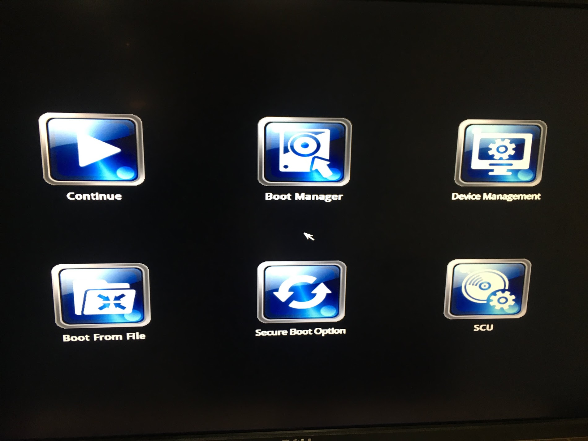

# babyIOC
Motivation of **_babyIOC_** is to create a portable small form factor control system solution for mobile experimental stations and test systems.  
**_babyIOC_** is an easy to assemble, plug and play Debian server with deployed [NSLS2 EPICS Debian distribution](https://epicsdeb.bnl.gov/debian/), compiled  [areaDetector]( https://github.com/areaDetector) package, and NSLS2 [bluesky](https://github.com/NSLS-II/bluesky) Data Acquisition Suite. Prosilica sample IOC is deployed at /epics/iocs.  

# Current Image details
- Debian Jessie
- [NSLS2 EPICS Debian distribution](https://epicsdeb.bnl.gov/debian/), which is built from [epicsdeb](https://github.com/epicsdeb) repository. 
- areaDetector-3-3-1 with  
<ul>
 <ul>
  <li>epics-base R7.0.1.1</li>
  <li>ipac R2.14 </li>
  <li>seq R2.2.5</li>
  <li>asyn R4.33</li>
  <li>autosave R5.9</li>
  <li>busy R1.7</li>
  <li>sscan R2.11.1</li>
  <li>calc R3.7</li>
  <li>ioc-stats R3.1.15</li>
</ul>
 </ul>
 
- X2Go server  
- NSLS2 [bluesky](https://github.com/NSLS-II/bluesky) software suite

 

## Introduction
Building an EPICS Control System from scratch could be tedious, time consuming and challenging for beginners.
We offer you an out of the box solution. When you buy and assemble this Single Board Computer, you can load our pre-created image onto microSD card, boot the discless babyIOC computer from this microSD card and build your EPICS iocs using prebuild libraries and packages. If the community finds this useful, we can add more modules, sample iocs to ease the learning curve, etc. The image also has NSLS2 [bluesky](https://github.com/NSLS-II/bluesky) software deployed for those who are intersted to try it out.
 ## Hardware and parts
We have conducted much research, reviewing many vendors which offer small factor Single Board Computes(SBC) including: Beagleboard, RaspberryPI, BoundaryDevices, Nvidia, Hardkernel, PCengineering, EmbeddedArm, and Udoo.  
  
The selected hardware is [UDOO x86 Ultra board](https://shop.udoo.org/x86/udoo-x86-ultra.html), which can be enhanced with different daughter cards. In this project we use an ethernet daughter card, which adds 2 additional interfaces useful in any controls environment.  Though the hardware can be purchased from many distributors, we advise buying directly from [UDOO](https://shop.udoo.org/). They ship fast. 

Parts list:
- UDOO x86 Ultra
- UDOO x86 metal case
- CPU fan for UDOO x86 heatsink 
- M.2 dual Ethernet Module Kit
- Power Supply USA
- HDMI to HDMI cable, or other cable to connect the monitor. We used HDMI port. 
- microSD memory card 16GB or bigger 

 
## [Assemble the Hardware](#hardware)

## [Copy Image onto microSD Card](#microSD) 

  
## [You are ready to boot!](#boot)
root -   "babyIOCroot"  
iocuser -"$babyioc$"
## [Reconfiguring network interfaces](#network)

## References
- [babyIOC contribution @ EPICS collaboration meeting 2018 in APS](https://epics.anl.gov/meetings/2018-06/talks/06-14/PM/7.11.pdf)
- [EPICS Debian source](https://github.com/epicsdeb)
- [NSLS2 EPICS Debian repository](https://epicsdeb.bnl.gov/debian/)
- [areaDetector package](https://github.com/areaDetector/)

## Credits
* Oksana Ivashkevych (BNL) vision, driver, babyIOC mother
* Thomas Smith (BNL) sysadmin babyIOC father 
* Dennis Poshka (BNL) babyIOC technician
* Leon Flaks (BNL) image conditioning, project hosting @[https://epicsdeb.bnl.gov/babyIOC](https://epicsdeb.bnl.gov/babyIOC/)
* Thomas Caswell (BNL) bluesky deployment
* Matt Cowan (BNL) sysadmin help
* Kevin Peterson (ANL) ideas for disc size expansion
* 28ID1, Milinda Abeykoon, Julian Adams (BNL) project support
* Christopher Stelmach (BNL) drawing modification to add a cutoff  
  
# DETAIL SECTION
##   Assemble the hardware. 
Vendor's instructions on how to assemble the hardware can be found [here](https://www.udoo.org/docs-x86/Hardware_&_Accessories/Official_Accessories.html). Vendor's metal case is desiged to hold a board without accesories. In order to use this metal case with Ethernet daughter board, one needs to cut an opening in the back side. The original drawing can be found [here](http://download.udoo.org/files//UDOO_X86/mechanical_specs/UDOO_X86_metal_case_drawing.pdf). The needed cut out is indicated on [UDOO_X86_metal_case_drawing-MODIFIED.pdf](UDOO_X86_metal_case_drawing-MODIFIED.pdf). 

## Copy image onto microSD card. 
- plug in  microSD card into your linux box. We used microSD-miniSD-USB dungle.  
- run cat /proc/partitions to see what the device name is. It usualy comes up as /dev/sdb
<pre><code> 
oksana@oksana-linux:~$ cat /proc/partitions
major minor  #blocks  name

   8        0  244140625 sda
   8        1  234219520 sda1
   8        2          1 sda2
   8        5    9918464 sda5
   8       16  122241024 sdb
   8       17  121634816 sdb1
   8       18          1 sdb2
   8       21     604160 sdb5
</code></pre>
Copy image onto microSD card. You should become root.
<pre><code>
root@oksana-linux:/home/oksana# date; dd if=udooImage of=/dev/sdb bs=64k; date
Thu Oct 11 15:11:48 EDT 2018
243096+0 records in
243096+0 records out
15931539456 bytes (16 GB) copied, 597.654 s, 26.7 MB/s
Thu Oct 11 15:21:45 EDT 2018
root@oksana-linux:/home/oksana# 
  
</code></pre>
**Word of warning:** *_dd command will happily overwrite your system's hard drive if you use the wrong /dev/sdX and it won't warn you or anything since you are root._* Always double check the dd commands! An easy way to remember the dangers of this command are to think of 'dd' as 'disk destroyer'.

You can plug your microSD card and boot, however if your microSD card size was more then 16GB, you will not be able to use it at this time.

## Extend your disc partition and file system.
We used [this link](http://www.runeaudio.com/documentation/troubleshooting/extend-partition-sd/) as a resource.
The commands below will output information about all your partitions. We will show outputs only the partition which is being resized.
<pre><code>
root@oksana-linux:/home/oksana# fdisk -l
......
Disk /dev/sdb: 116.6 GiB, 125174808576 bytes, 244482048 sectors
Units: sectors of 1 * 512 = 512 bytes
Sector size (logical/physical): 512 bytes / 512 bytes
I/O size (minimum/optimal): 512 bytes / 512 bytes
Disklabel type: dos
Disk identifier: 0x9adc4c27

Device     Boot    Start      End  Sectors  Size Id Type
/dev/sdb1  *        2048 29747199 29745152 14.2G 83 Linux
/dev/sdb2       29749246 31115263  1366018  667M  5 Extended
/dev/sdb5       29749248 31115263  1366016  667M 82 Linux swap / Solaris
</code></pre>
  Since we want to extend Linux partion, which happened to be the boot partition as well, the only way to do this is to delete all partions, and recreate them again.
  <pre><code>
  # fdisk /dev/sdb
  </code></pre> 
  1. Delete by pressing "d" and accepting the default suggestions. Repeat until all partitions are deleted
  2. Press "n" to create new partion, 'p' for primary,Last  1, offered default, fist sector offered 2048, since you have to perserve your boot partion beginning, and accept default for your last sector. Your total size will most likely be less then you expected, SD card vendors are a bit creative with the size definition.
  3. press w to write changes and exit
  
  You do not need to create swap partition because the image file has a swap file configured as a part of the system. The swap file size is a relatively small 1GB to conserve space for a 16GB SD card. You can resize the swap file to your liking if you need  more swap space, but it must be done on a running system. Please follow [this instructions](#swap).
  
  Now you need to resize your file system to use all available space on your SD card. If you run #resize2fs /dev/sdb1, you will be asked to run e2fsck first.
  <pre><code>
  #e2fsck -f /dev/sdb1
  </code></pre>
press y (for yes) for offers to correct the errors
 <pre><code>
  #resize2fs  /dev/sdb1
  </code></pre>
  
  You are ready to boot now!
  
##  Your fist Boot  
Connect a monitor, we used HDMI port, a mouse and keyboard. We used one USB dongle for both peripherals. When you power on the board, you may see the "no botable device" or another similar error. The bootloader needs to be changed. 
- Keep pressing Esc button, while power is applied. 

- Select **Boot Manager**. Inside you have to choose legacy boot option. We have seen different screens for this step on identical board units we purchased at different times:

  

       
  

 

     _
  

  

    
  

  

Your boot is set!
##  Reconfiguring network interfaces
**babyIOC** image has DHCP configured interfaces, you can reconfigure them to your taste in /etc/network/interfaces. 

In any case delete content in  
/etc/udev/rules.d/70-persistent-net.rules. 

This file is being created by operating system and includes mac address of your Ethernet cards. Since you have a new hardware, new interfaces will be created.

## Changing the host name:

-Edit the hostname in these files
/etc/hostname
/etc/mailname (might not exist)
/etc/hosts

**Reboot**

## Resize swap file
To resize, first create a new swap file. Substitute with size of the form '#G'. For example, for an 8GB swap file, use 8G. You can put this file anywhere you want, and name it whatever you want, so put it somewhere and name it something that makes sense. In this example, I'll use /mnt/swapfile.swap and a size of 4GB
<pre><code>
  fallocate -l 4G /mnt/swapfile.swap
</code></pre>
Next, format the file for use as swap
<pre><code>
  mkswap /mnt/swapfile.swap
</code></pre>
Now we will get rid of the old swap file and activate the new one
<pre><code>
  swapoff /mnt/1GB.swap
  rm /mnt/1GB.swap
  swapon /mnt/swapfile.swap
</code></pre>
Make sure to change permissions on your swap file so it is not world-readable!
<pre><code>
  chmod 600 /mnt/swapfile.swap
</code></pre>
Finally, to make these changes persist across reboots, edit the file /etc/fstab with your favorite editor. Replace the old file name with the new one
<pre><code>
  #swapfile
  /mnt/swapfile.swap   none            swap    sw              0       0
</code></pre>

## Enjoy!
